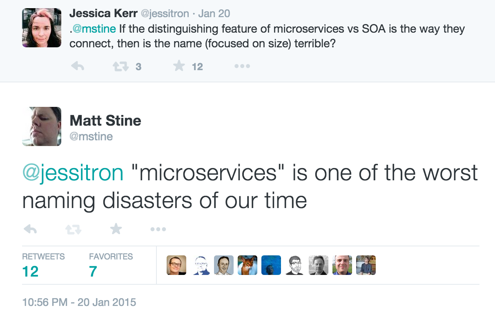
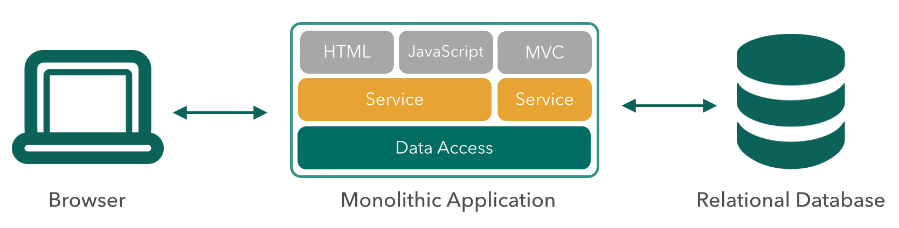
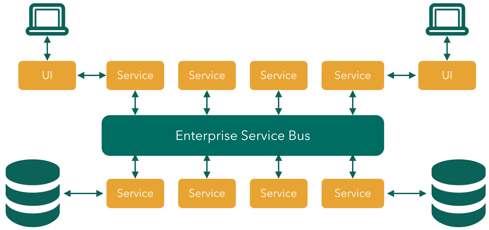
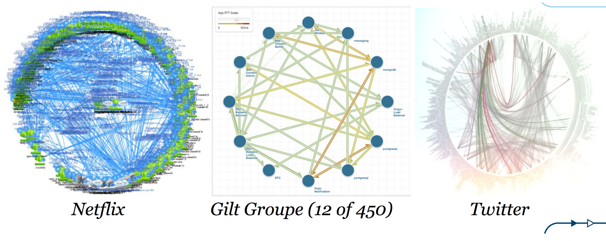
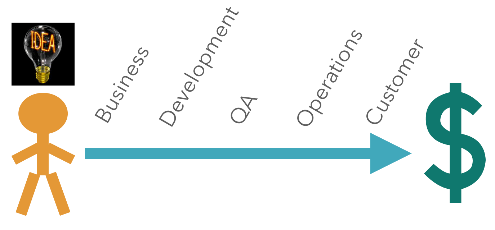
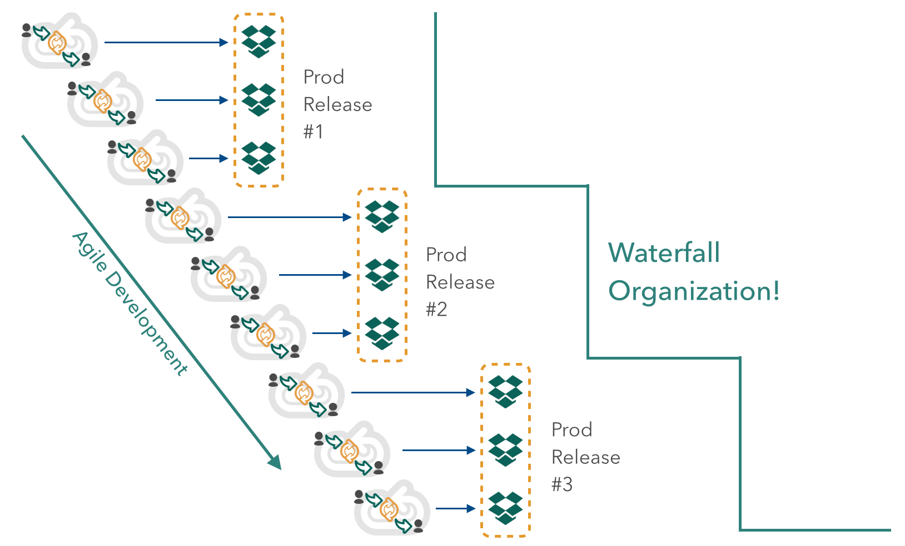
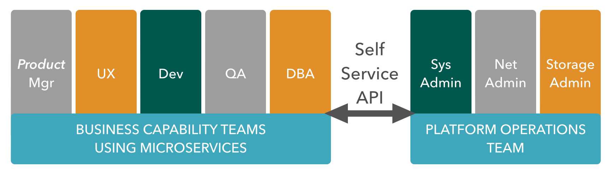
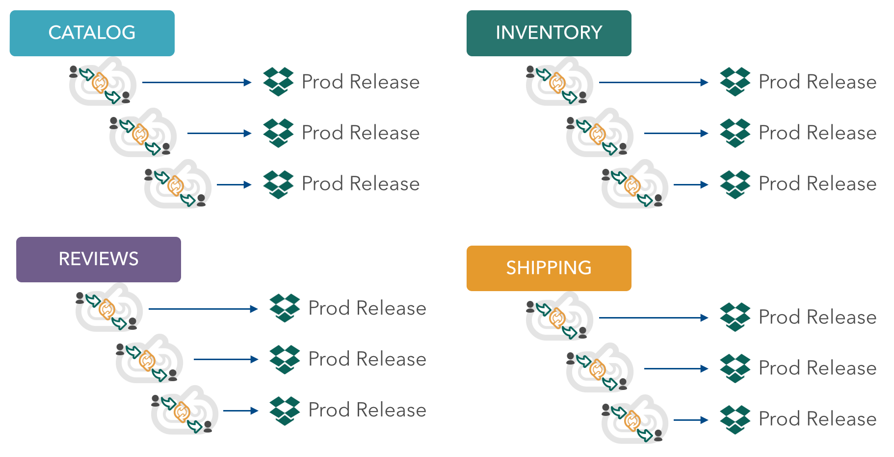
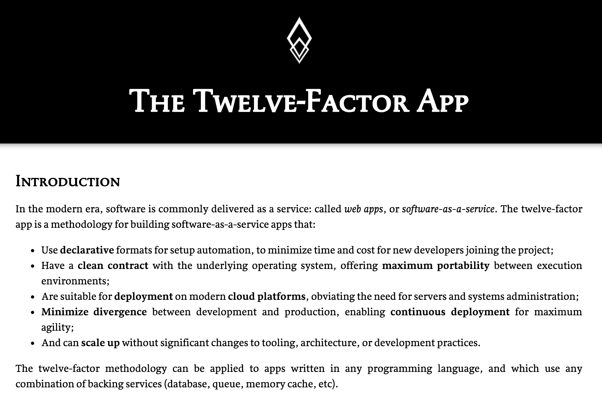
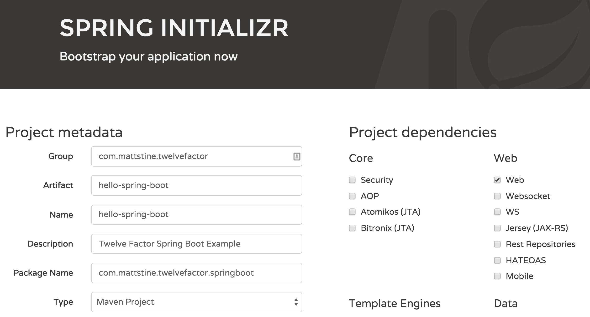

slidenumbers: true

# [fit] Cloud-Native
# [fit] Application
# [fit] Architectures
# [fit] with Spring and Cloud Foundry

---

# [fit] FREE

Compliments of Pivotal

[http://bit.ly/cloud-native-book](http://bit.ly/cloud-native-book)

---

# [fit] Session
# [fit] One

---

# [fit] Cloud-Native
# [fit] Architecture
# [fit] Overview

---

# [fit] Why?

---

# [fit] Speed
# [fit] Safety
# [fit] Scale
# [fit] Mobility

---

# [fit] What?

---

# What?

- Twelve Factor Apps ([http://12factor.net](http://12factor.net))
- Microservices
- Self-Service Agile Infrastructure
- API-based Collaboration
- Antifragility

---

# There Seems to Be Some Hype...

---

---

# Define: Microservice
> Loosely coupled service oriented architecture with bounded contexts...
-- Adrian Cockcroft

---

# Loosely Coupled

If every service has to be updated in concert, it’s not loosely coupled!

---

# Bounded Contexts

If you have to know about surrounding services you don’t have a bounded context.

---

# Not Monoliths...

---

# Not Traditional (ESB-centric) SOA...

---

# But Microservices!

---

# Enabling Continuous Delivery

---

# Agile: Iterative Feedback Loops

---

# Waterscrumfall

---

# Conway's Law

> Any organization that designs a system (defined broadly) will produce a design whose structure is a copy of the organization's communication structure.
-- Melvyn Conway, 1967

---

# The Inverse Conway Manuever

---

# Continuous Delivery

---

# [fit] Building
# [fit] Twelve-Factor
# [fit] Apps
# [fit] with Spring Boot

---

# [fit] http://12factor.net

---

# Patterns

- Cloud-native application architectures
- Optimized for speed, safety, & scale
- Declarative configuration
- Stateless/shared-nothing processes
- Loose coupling to application environment

---

# Twelve Factors (1/2)

- One Codebase in Version Control
- Explicit Dependencies
- Externalized Config
- Attached Backing Services
- Separate Build, Release, and Run Stages
- Stateless, Shared-Nothing Processes

---

# Twelve Factors (2/2)

- Export Services via Port binding
- Scale Out Horizontally for Concurrency
- Instances Should Be Disposable
- Dev/Prod Parity
- Logs Are Event Streams
- Admin Processes

---

# [fit] http://heroku.com

---

# [fit] http://cloudfoundry.org

---

# Microframeworks

- Dropwizard ([http://www.dropwizard.io/](http://www.dropwizard.io/))
- Spring Boot ([http://projects.spring.io/spring-boot/](http://projects.spring.io/spring-boot/))

---

# Spring Boot
- [http://projects.spring.io/spring-boot](http://projects.spring.io/spring-boot)
- Opinionated convention over configuration
- Production-ready Spring applications
- Embed Tomcat, Jetty or Undertow
- *STARTERS*
- Actuator: Metrics, health checks, introspection

---

# [http://start.spring.io](start.spring.io)

---

# [fit] TO THE
# [Fit] LABS!
