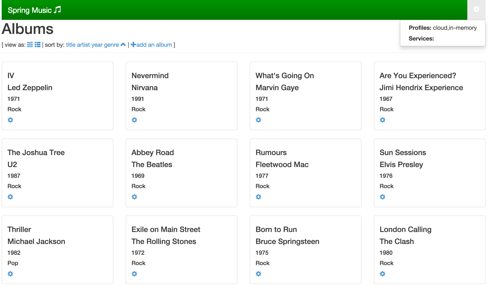

= Lab 5 - From Zero to Pushing Your First Application

== Registration Steps (WIP):

. Make sure you've created a Pivotal Web Services (PWS) account as indicated in the prerequisites.
. Enter your username (the email address you used to register with PWS) on any unused row of the class https://docs.google.com/spreadsheets/d/1kMlV-D3pIVQfhsDDcfFXDgYRsZk7zY7i-dQy0n098_E[Google Sheet].
. We'll run a script that gets everyone added to the appropriate space on PWS.
. Once we've run this script, you should be able to start the lab.

== Target

. If you haven't already, download the latest release of the Cloud Foundry CLI from https://github.com/cloudfoundry/cli/releases for your operating system and install it.

. Set the API target for the CLI:
+
----
$ cf api api.run.pivotal.io
----

. Login to Pivotal Web Services:
+
----
$ cf login
----
+
Follow the prompts, choosing `oreilly-class` when prompted for an organization and `studentXX` when prompted for a space.

== Build and Push!

. Change to the _Spring Music_ sample application directory:
+
----
$ cd $COURSE_HOME/day_01/session_02/lab_05/spring-music
----

. Using the Gradle Wrapper, build and package the application:
+
----
$ ./gradlew assemble
----
+
The Gradle Wrapper will automatically download the appropriate version of Gradle for this project along with all of _Spring Music_'s dependencies. This may take a few moments.

. Push the application!
+
----
$ cf push
----
+
You should see output similar to the following listing. Take a look at the listing callouts for a play-by-play of what's happening:
+
====
----
Using manifest file /Users/pivotal/mstine/2015/OReilly/CloudNativeArchitectureClass/day_01/session_02/lab_05/spring-music/manifest.yml <1>

Creating app spring-music in org oreilly-class / space instructor as mstine@pivotal.io...
OK <2>

Creating route spring-music-hippest-shaman.cfapps.io...
OK <3>

Binding spring-music-hippest-shaman.cfapps.io to spring-music...
OK <4>

Uploading spring-music... <5>
Uploading app files from: /Users/pivotal/mstine/2015/OReilly/CloudNativeArchitectureClass/day_01/session_02/lab_05/spring-music/build/libs/spring-music.war
Uploading 569.7K, 90 files
Done uploading
OK

Starting app spring-music in org oreilly-class / space instructor as mstine@pivotal.io... <6>
-----> Downloaded app package (21M)
-----> Java Buildpack Version: v2.6.1 |  https://github.com/cloudfoundry/java-buildpack.git#2d92e70
-----> Downloading Open Jdk JRE 1.8.0_31 from https://download.run.pivotal.io/openjdk/lucid/x86_64/openjdk-1.8.0_31.tar.gz (1.3s)
       Expanding Open Jdk JRE to .java-buildpack/open_jdk_jre (1.2s) <7>
-----> Downloading Spring Auto Reconfiguration 1.7.0_RELEASE from https://download.run.pivotal.io/auto-reconfiguration/auto-reconfiguration-1.7.0_RELEASE.jar (0.1s)
-----> Downloading Tomcat Instance 8.0.18 from https://download.run.pivotal.io/tomcat/tomcat-8.0.18.tar.gz (0.4s)
       Expanding Tomcat to .java-buildpack/tomcat (0.1s) <8>
-----> Downloading Tomcat Lifecycle Support 2.4.0_RELEASE from https://download.run.pivotal.io/tomcat-lifecycle-support/tomcat-lifecycle-support-2.4.0_RELEASE.jar (0.0s)
-----> Downloading Tomcat Logging Support 2.4.0_RELEASE from https://download.run.pivotal.io/tomcat-logging-support/tomcat-logging-support-2.4.0_RELEASE.jar (0.0s)
-----> Downloading Tomcat Access Logging Support 2.4.0_RELEASE from https://download.run.pivotal.io/tomcat-access-logging-support/tomcat-access-logging-support-2.4.0_RELEASE.jar (0.0s)
-----> Uploading droplet (66M) <9>

0 of 1 instances running, 1 starting
1 of 1 instances running

App started

OK

App spring-music was started using this command `JAVA_HOME=$PWD/.java-buildpack/open_jdk_jre JAVA_OPTS="-Djava.io.tmpdir=$TMPDIR -XX:OnOutOfMemoryError=$PWD/.java-buildpack/open_jdk_jre/bin/killjava.sh -Xmx382293K -Xms382293K -XX:MaxMetaspaceSize=64M -XX:MetaspaceSize=64M -Xss995K -Daccess.logging.enabled=false -Dhttp.port=$PORT" $PWD/.java-buildpack/tomcat/bin/catalina.sh run` <10>

Showing health and status for app spring-music in org oreilly-class / space instructor as mstine@pivotal.io... <11>
OK

requested state: started
instances: 1/1
usage: 512M x 1 instances
urls: spring-music-hippest-shaman.cfapps.io
last uploaded: Fri Feb 13 15:43:08 UTC 2015

     state     since                    cpu    memory           disk
#0   running   2015-02-13 09:43:55 AM   0.0%   394.5M of 512M   131.1M of 1G
----
<1> The CLI is using a manifest to provide necessary configuration details such as application name, memory to be allocated, and path to the application artifact.
Take a look at `manifest.yml` to see how.
<2> In most cases, the CLI indicates each Cloud Foundry API call as it happens.
In this case, the CLI has created an application record for _Spring Music_ in your assigned space.
<3> All HTTP/HTTPS requests to applications will flow through Cloud Foundry's front-end router called http://docs.cloudfoundry.org/concepts/architecture/router.html[(Go)Router].
Here the CLI is creating a route with random word tokens inserted (again, see `manifest.yml` for a hint!) to prevent route collisions across the default `cfapps.io` domain.
<4> Now the CLI is _binding_ the created route to the application.
Routes can actually be bound to multiple applications to support techniques such as http://www.mattstine.com/2013/07/10/blue-green-deployments-on-cloudfoundry[blue-green deployments].
<5> The CLI finally uploads the application bits to PWS. Notice that it's uploading _90 files_! This is because Cloud Foundry actually explodes a ZIP artifact before uploading it for caching purposes.
<6> Now we begin the staging process. The https://github.com/cloudfoundry/java-buildpack[Java Buildpack] is responsible for assembling the runtime components necessary to run the application.
<7> Here we see the version of the JRE that has been chosen and installed.
<8> And here we see the version of Tomcat that has been chosen and installed.
<9> The complete package of your application and all of its necessary runtime components is called a _droplet_.
Here the droplet is being uploaded to PWS's internal blobstore so that it can be easily copied to one or more _http://docs.cloudfoundry.org/concepts/architecture/execution-agent.html[Droplet Execution Agents (DEA's)]_ for execution.
<10> The CLI tells you exactly what command and argument set was used to start your application.
<11> Finally the CLI reports the current status of your application's health.
You can get the same output at any time by typing `cf app spring-music`.
====

. Visit the application in your browser by hitting the route that was generated by the CLI:
+

+
Be sure to click on the ``information icon'' in the top right-hand corner of the UI.
This gives you important information about the state of the currently running _Spring Music_ instance, including what Spring Profiles are turned on and what Cloud Foundry services are bound.
It will become important in the next lab!
