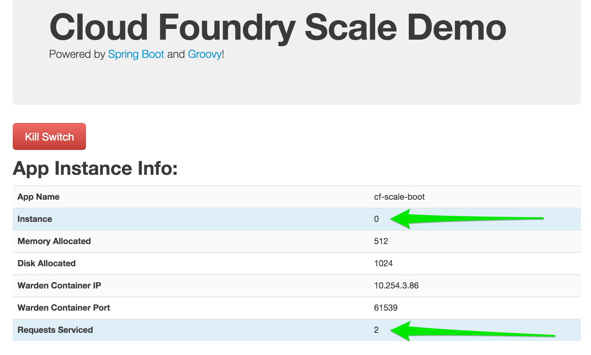
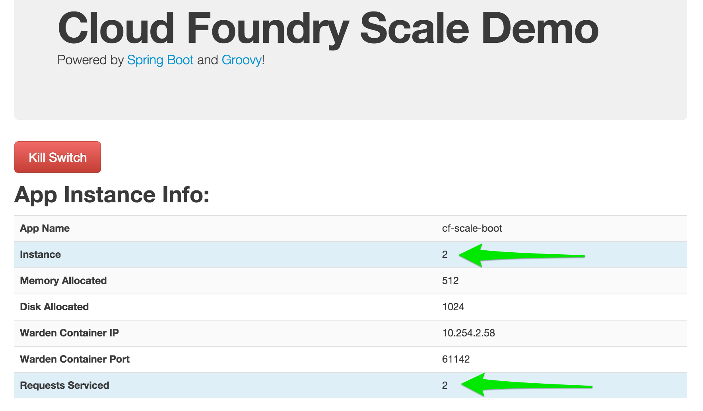
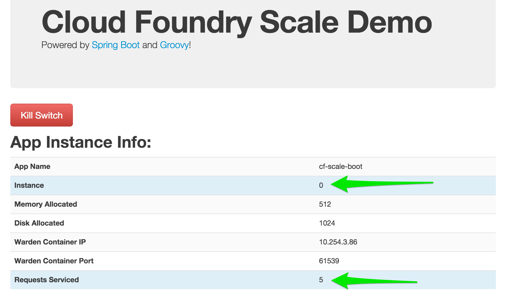

= Lab 7 - Scaling Applications

[abstract]
--
Cloud Foundry makes the work of horizontally scaling application instances and updating load balancer routing tables easy.

In this lab, we'll use a Spring Boot CLI app designed to illustrate Cloud Foundry operations such as scaling.
--

== Push the `cf-scale-boot` Application

. Change to the `cf-scale-boot` sample application directory:
+
----
$ cd $COURSE_HOME/day_01/session_02/lab_07/cf-scale-boot
----

. Spring Boot CLI applications do not require a separate build step, so go ahead and push the application:
+
----
$ cf push
----

. Once again, this application's manifest is configured to have a random route assigned to the application.
So, when the CLI indicates that application is up and running, visit its route in the browser:
+

+
You'll see that the application is reporting various bits of information that it has discovered from its environment.
Of primary interest is that this application reports its _instance index_.
It also keeps track of and reports how many web requests that this instance has serviced.

== Scale the Application Up

. Now let's increase the number of running application instances to 5:
+
----
$ cf scale -i 5 cf-scale-boot
Scaling app cf-scale-boot in org oreilly-class / space instructor as mstine@pivotal.io...
OK
----
+
In reporting `OK`, the CLI is letting you know that the additional requested instances have been started, but they are not yet necessarily running.

. We can determine how many instances are actually running like this:
+
====
----
$ cf app cf-scale-boot
Showing health and status for app cf-scale-boot in org oreilly-class / space instructor as mstine@pivotal.io...
OK

requested state: started
instances: 5/5
usage: 512M x 5 instances
urls: cf-scale-boot-stockinged-rust.cfapps.io
last uploaded: Fri Feb 13 18:56:29 UTC 2015

     state      since                    cpu    memory           disk
#0   running    2015-02-13 12:57:10 PM   0.1%   404.8M of 512M   128.9M of 1G <1>
#1   starting   2015-02-13 03:04:33 PM   0.0%   0 of 0           0 of 0 <2>
#2   running    2015-02-13 03:04:47 PM   0.0%   398.7M of 512M   128.9M of 1G
#3   starting   2015-02-13 03:04:33 PM   0.0%   0 of 0           0 of 0
#4   starting   2015-02-13 03:04:33 PM   0.0%   0 of 0           0 of 0
----
<1> This application instance has completed the startup process and is actually able to accept requests.
<2> This application instance is still starting and will not have any requests routed to it.
====

. Eventually all instances will converge to a running state:
+
----
$ cf app cf-scale-boot
Showing health and status for app cf-scale-boot in org oreilly-class / space instructor as mstine@pivotal.io...
OK

requested state: started
instances: 5/5
usage: 512M x 5 instances
urls: cf-scale-boot-stockinged-rust.cfapps.io
last uploaded: Fri Feb 13 18:56:29 UTC 2015

     state     since                    cpu    memory           disk
#0   running   2015-02-13 12:57:10 PM   0.1%   404.8M of 512M   128.9M of 1G
#1   running   2015-02-13 03:04:51 PM   0.1%   377.5M of 512M   128.9M of 1G
#2   running   2015-02-13 03:04:47 PM   0.1%   397.3M of 512M   128.9M of 1G
#3   running   2015-02-13 03:05:03 PM   0.0%   389.2M of 512M   128.9M of 1G
#4   running   2015-02-13 03:04:52 PM   0.1%   393.4M of 512M   128.9M of 1G
----

. Revisit the application route in the browser.
Refresh several times.
You should observe the instance index and request counters changing as you do so:
+

+
The aforementioned http://docs.cloudfoundry.org/concepts/architecture/router.html[(Go)Router] is applying a random routing algorithm to all of the application instances assigned to this route.
As an instance reaches the `running` state, its http://docs.cloudfoundry.org/concepts/architecture/execution-agent.html[DEA] registers that instance in the routing table assigned to its route by sending a message to Cloud Foundry's message bus.
All (Go)Router instances are subscribed to this channel and register the routes independently.
This makes for very dynamic and rapid reconfiguration!

== Scale the Application Down

. We can scale the application instances back down as easily as we scaled them up, using the same command structure:
+
----
$ cf scale -i 1 cf-scale-boot
Scaling app cf-scale-boot in org oreilly-class / space instructor as mstine@pivotal.io...
OK
----

. Check the application status again:
+
----
$ cf app cf-scale-boot
Showing health and status for app cf-scale-boot in org oreilly-class / space instructor as mstine@pivotal.io...
OK

requested state: started
instances: 1/1
usage: 512M x 1 instances
urls: cf-scale-boot-stockinged-rust.cfapps.io
last uploaded: Fri Feb 13 18:56:29 UTC 2015

     state     since                    cpu    memory         disk
#0   running   2015-02-13 12:57:10 PM   0.1%   405M of 512M   128.9M of 1G
----
+
As you can see, we're back down to only one instance running, and it is in fact the original index 0 that we started with.

. Confirm that by again revisiting the route in the browser and checking the instance index and request counter:
+

