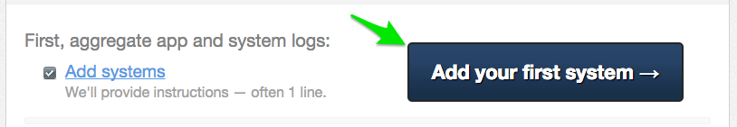
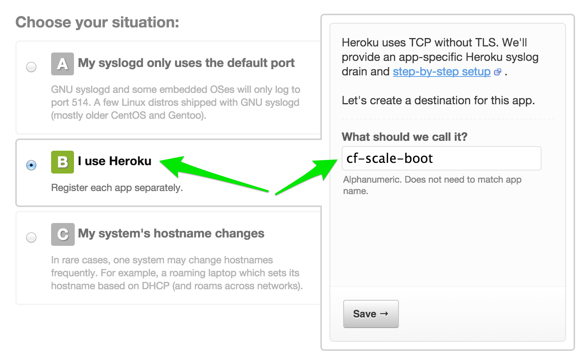
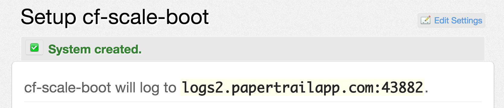
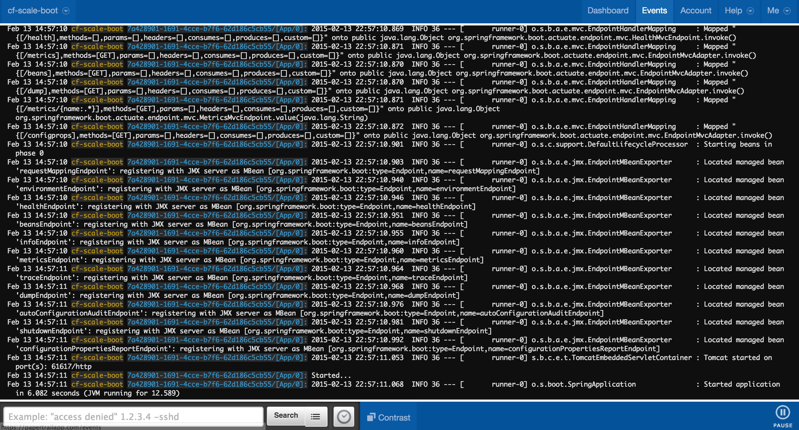
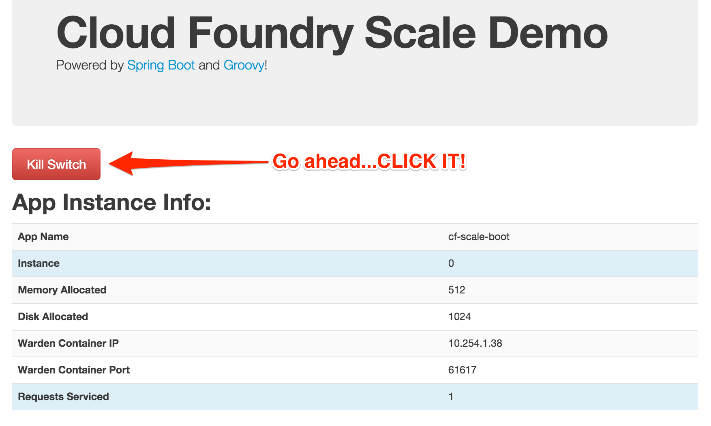
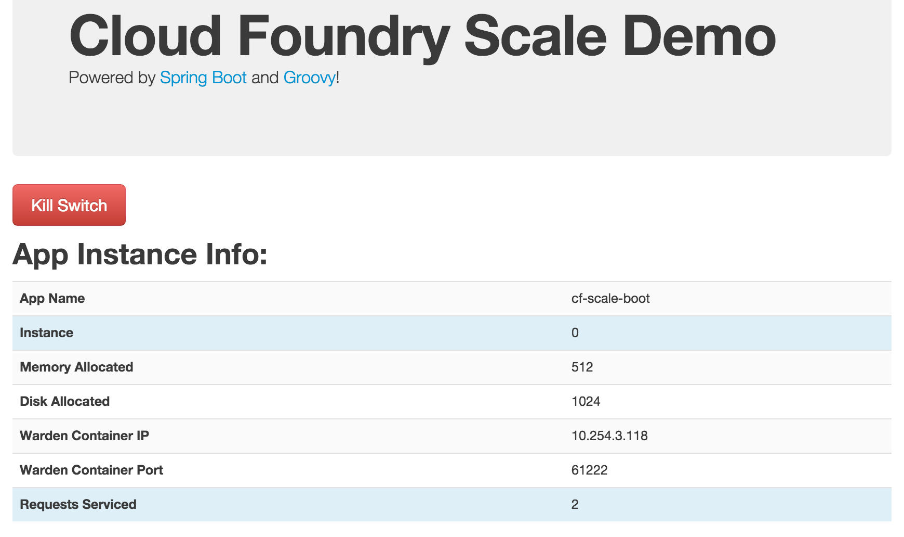

:compat-mode:
= Lab 8 - Monitoring Applications

Cloud Foundry provides several built-in mechanisms that allow us to monitor our applications' state changes and behavior.
Additionally, Cloud Foundry actively monitors the health of our application processes and will restart them should they crash.
In this lab, we'll explore a few of these mechanisms.

== Events

Cloud Foundry only allows application configuration to be modified via its API.
This gives application operators confidence that all changes to application configuration are known and auditable.
It also reduces the number of causes that must be considered when problems arise.

All application configuration changes are recorded as _events_.
These events can be viewed via the Cloud Foundry API, and viewing is facilitated via the CLI.

Take a look at the events that have transpired so far for our deployment of `cf-scale-boot`:

====
----
$ cf events cf-scale-boot
Getting events for app cf-scale-boot in org oreilly-class / space instructor as mstine@pivotal.io...

time                          event                 actor               description
2015-02-13T15:18:33.00-0600   audit.app.update      mstine@pivotal.io   instances: 1 <6>
2015-02-13T15:04:34.00-0600   audit.app.update      mstine@pivotal.io   instances: 5 <5>
2015-02-13T12:56:35.00-0600   audit.app.update      mstine@pivotal.io   state: STARTED <4>
2015-02-13T12:56:26.00-0600   audit.app.update      mstine@pivotal.io <3>
2015-02-13T12:56:26.00-0600   audit.app.map-route   mstine@pivotal.io <2>
2015-02-13T12:56:24.00-0600   audit.app.create      mstine@pivotal.io   instances: 1, memory: 512, state: STOPPED, environment_json: PRIVATE DATA HIDDEN <1>
----
<1> Events are sorted newest to oldest, so we'll start from the bottom.
Here we see the `app.create` event, which created our application's record and stored all of its metadata (e.g. `memory: 512`).
<2> The `app.map-route` event records the incoming request to assign a route to our application.
<3> This `app.update` event records the resulting change to our applications metadata.
<4> This `app.update` event records the change of our application's state to `STARTED`.
<5> Remember scaling the application up? This `app.update` event records the metadata change `instances: 5`.
<6> And here's the `app.update` event recording our scaling of the application back down with `instances: 1`.
====

. Let's explicitly ask for the application to be stopped:
+
----
$ cf stop cf-scale-boot
Stopping app cf-scale-boot in org oreilly-class / space instructor as mstine@pivotal.io...
OK
----

. Now, examine the additional `app.update` event:
+
----
$ cf events cf-scale-boot
Getting events for app cf-scale-boot in org oreilly-class / space instructor as mstine@pivotal.io...

time                          event                 actor               description
2015-02-13T15:59:10.00-0600   audit.app.update      mstine@pivotal.io   state: STOPPED
2015-02-13T15:18:33.00-0600   audit.app.update      mstine@pivotal.io   instances: 1
2015-02-13T15:04:34.00-0600   audit.app.update      mstine@pivotal.io   instances: 5
2015-02-13T12:56:35.00-0600   audit.app.update      mstine@pivotal.io   state: STARTED
2015-02-13T12:56:26.00-0600   audit.app.update      mstine@pivotal.io
2015-02-13T12:56:26.00-0600   audit.app.map-route   mstine@pivotal.io
2015-02-13T12:56:24.00-0600   audit.app.create      mstine@pivotal.io   instances: 1, memory: 512, state: STOPPED, environment_json: PRIVATE DATA HIDDEN
----

. Start the application again:
+
----
$ cf start cf-scale-boot
Starting app cf-scale-boot in org oreilly-class / space instructor as mstine@pivotal.io...

0 of 1 instances running, 1 starting
0 of 1 instances running, 1 starting
0 of 1 instances running, 1 starting
1 of 1 instances running

App started

OK

App cf-scale-boot was started using this command `JAVA_HOME=$PWD/.java-buildpack/open_jdk_jre JAVA_OPTS="-Djava.io.tmpdir=$TMPDIR -XX:OnOutOfMemoryError=$PWD/.java-buildpack/open_jdk_jre/bin/killjava.sh -Xmx382293K -Xms382293K -XX:MaxMetaspaceSize=64M -XX:MetaspaceSize=64M -Xss995K" SERVER_PORT=$PORT $PWD/.java-buildpack/spring_boot_cli/bin/spring run app.groovy`

Showing health and status for app cf-scale-boot in org oreilly-class / space instructor as mstine@pivotal.io...
OK

requested state: started
instances: 1/1
usage: 512M x 1 instances
urls: cf-scale-boot-stockinged-rust.cfapps.io
last uploaded: Fri Feb 13 18:56:29 UTC 2015

     state     since                    cpu    memory           disk
#0   running   2015-02-13 04:01:50 PM   0.0%   389.1M of 512M   128.9M of 1G
----

. And again, view the additional `app.update` event:
+
----
$ cf events cf-scale-boot
Getting events for app cf-scale-boot in org oreilly-class / space instructor as mstine@pivotal.io...

time                          event                 actor               description
2015-02-13T16:01:28.00-0600   audit.app.update      mstine@pivotal.io   state: STARTED
2015-02-13T15:59:10.00-0600   audit.app.update      mstine@pivotal.io   state: STOPPED
2015-02-13T15:18:33.00-0600   audit.app.update      mstine@pivotal.io   instances: 1
2015-02-13T15:04:34.00-0600   audit.app.update      mstine@pivotal.io   instances: 5
2015-02-13T12:56:35.00-0600   audit.app.update      mstine@pivotal.io   state: STARTED
2015-02-13T12:56:26.00-0600   audit.app.update      mstine@pivotal.io
2015-02-13T12:56:26.00-0600   audit.app.map-route   mstine@pivotal.io
2015-02-13T12:56:24.00-0600   audit.app.create      mstine@pivotal.io   instances: 1, memory: 512, state: STOPPED, environment_json: PRIVATE DATA HIDDEN
----

== Logs

One of the most important enablers of visibility into application behavior is logging.
Effective management of logs has historically been very difficult.
Cloud Foundry's https://github.com/cloudfoundry/loggregator[log aggregation] components simplify log management by assuming responsibility for it.
Application developers need only log all messages to either `STDOUT` or `STDERR`, and the platform will capture these messages.

=== For Developers

Application developers can view application logs using the CF CLI.

. Let's view recent log messages for `cf-scale-boot`:
+
----
$ cf logs cf-scale-boot --recent
----
+
Here are two interesting subsets of one output from that command:
+
.CF Component Logs
====
----
2015-02-13T14:45:39.40-0600 [RTR/0]      OUT cf-scale-boot-stockinged-rust.cfapps.io - [13/02/2015:20:45:39 +0000] "GET /css/bootstrap.min.css HTTP/1.1" 304 0 "http://cf-scale-boot-stockinged-rust.cfapps.io/" "Mozilla/5.0 (Macintosh; Intel Mac OS X 10_9_5) AppleWebKit/537.36 (KHTML, like Gecko) Chrome/40.0.2214.111 Safari/537.36" 10.10.66.88:50372 x_forwarded_for:"50.157.39.197" vcap_request_id:84cc1b7a-bb30-4355-7512-5adaf36ff767 response_time:0.013115764 app_id:7a428901-1691-4cce-b7f6-62d186c5cb55 <1>
2015-02-13T14:45:39.40-0600 [RTR/1]      OUT cf-scale-boot-stockinged-rust.cfapps.io - [13/02/2015:20:45:39 +0000] "GET /img/LOGO_CloudFoundry_Large.png HTTP/1.1" 304 0 "http://cf-scale-boot-stockinged-rust.cfapps.io/" "Mozilla/5.0 (Macintosh; Intel Mac OS X 10_9_5) AppleWebKit/537.36 (KHTML, like Gecko) Chrome/40.0.2214.111 Safari/537.36" 10.10.66.88:24323 x_forwarded_for:"50.157.39.197" vcap_request_id:b3e2466b-6a41-4c6d-5b3d-0f70702c0ec1 response_time:0.010003444 app_id:7a428901-1691-4cce-b7f6-62d186c5cb55
2015-02-13T15:04:33.09-0600 [API/1]      OUT Tried to stop app that never received a start event <2>
2015-02-13T15:04:33.51-0600 [DEA/12]     OUT Starting app instance (index 2) with guid 7a428901-1691-4cce-b7f6-62d186c5cb55 <3>
2015-02-13T15:04:33.71-0600 [DEA/4]      OUT Starting app instance (index 3) with guid 7a428901-1691-4cce-b7f6-62d186c5cb55
----
<1> An ``Apache-style'' access log event from the (Go)Router
<2> An API log event that corresponds to an event as shown in `cf events`
<3> A DEA log event indicating the start of an application instance on that DEA.
====
+
.Application Logs
====
----
2015-02-13T16:01:50.28-0600 [App/0]      OUT 2015-02-13 22:01:50.282  INFO 36 --- [       runner-0] o.s.b.a.e.jmx.EndpointMBeanExporter      : Located managed bean 'autoConfigurationAuditEndpoint': registering with JMX server as MBean [org.springframework.boot:type=Endpoint,name=autoConfigurationAuditEndpoint]
2015-02-13T16:01:50.28-0600 [App/0]      OUT 2015-02-13 22:01:50.287  INFO 36 --- [       runner-0] o.s.b.a.e.jmx.EndpointMBeanExporter      : Located managed bean 'shutdownEndpoint': registering with JMX server as MBean [org.springframework.boot:type=Endpoint,name=shutdownEndpoint]
2015-02-13T16:01:50.29-0600 [App/0]      OUT 2015-02-13 22:01:50.299  INFO 36 --- [       runner-0] o.s.b.a.e.jmx.EndpointMBeanExporter      : Located managed bean 'configurationPropertiesReportEndpoint': registering with JMX server as MBean [org.springframework.boot:type=Endpoint,name=configurationPropertiesReportEndpoint]
2015-02-13T16:01:50.36-0600 [App/0]      OUT 2015-02-13 22:01:50.359  INFO 36 --- [       runner-0] s.b.c.e.t.TomcatEmbeddedServletContainer : Tomcat started on port(s): 61316/http
2015-02-13T16:01:50.36-0600 [App/0]      OUT Started...
2015-02-13T16:01:50.36-0600 [App/0]      OUT 2015-02-13 22:01:50.364  INFO 36 --- [       runner-0] o.s.boot.SpringApplication               : Started application in 6.906 seconds (JVM running for 15.65)
----
====
+
As you can see, Cloud Foundry's log aggregation components capture both application logs and CF component logs relevant to your application.
These events are properly interleaved based on time, giving you an accurate picture of events as they transpired across the system.

. To get a running ``tail'' of the application logs rather than a dump, simply type:
+
----
$ cf logs cf-scale-boot
----
+
You can try various things like refreshing the browser and triggering stop/start events to see logs being generated.

=== For Operators (OPTIONAL)

Application operators will also enjoy commands like `cf logs`, but are often interested in long-term retention, indexing, and analysis of logs as well.
Cloud Foundry currently only provides short-term retention of logs.
To meet these needs, Cloud Foundry provides the ability to http://docs.cloudfoundry.org/devguide/services/log-management.html[drain logs to third-party providers.]

In this section, we'll drain logs to a very simple provider called https://papertrailapp.com[Papertrail].

. Visit https://papertrailapp.com and create a free account.

. Login to your account and add your first system:
+

. Click on ``Alternatives'':
+
image::../../../Common/images/papertrail_2.png[]

. Choose ``I use Heroku'' and provide a name:
+

. Note the URL + Port assigned to your application:
+

. We'll use a Cloud Foundry http://docs.cloudfoundry.org/devguide/services/user-provided.html[user-provided service instance] to create the log drain for our application using the URL + Port provided by Papertrail:
+
----
$ cf cups cf-scale-boot-logs -l syslog://logs2.papertrailapp.com:43882
Creating user provided service cf-scale-boot-logs in org oreilly-class / space instructor as mstine@pivotal.io...
OK
----

. We bind that service instance like those we created in link:../lab_06/lab_06.html[Lab 6]:
+
----
$ cf bs cf-scale-boot cf-scale-boot-logs
Binding service cf-scale-boot-logs to app cf-scale-boot in org oreilly-class / space instructor as mstine@pivotal.io...
OK
TIP: Use 'cf restage' to ensure your env variable changes take effect
----

. We'll use a `cf restart` rather than `cf restage` to make the binding take effect:
+
----
$ cf restart cf-scale-boot
----

. Refresh the Papertrail "Events" tab to see log events immediately flowing to the log viewing page:
+

You can see how to connect to other third-party log management systems in the http://docs.cloudfoundry.org/devguide/services/log-management-thirdparty-svc.html[Cloud Foundry documentation].

== Health

Cloud Foundry's http://docs.cloudfoundry.org/concepts/architecture/#hm9k[Heatlh Manager] actively monitors the health of our application processes and will restart them should they crash.

. If you don't have one already running, start a log tail for `cf-scale-boot`:
+
----
$ cf logs cf-scale-boot
----

. Visit the application in the browser, and click on the ``Kill Switch'' button. This button will trigger a JVM exit with an error code (`System.exit(1)`), causing the Health Manager to observe an application instance crash:
+

. After clicking the kill switch a couple of interesting things should happen.
First, you'll see an error code returned in the browser, as the request you submitted never returns a response:
+

+
Also, if you're paying attention to the log tail, you'll see some interesting log messages fly by:
+
====
----
2015-02-13T17:17:54.86-0600 [App/0]      OUT 2015-02-13 23:17:54.860 ERROR 36 --- [io-61617-exec-5] WebApplication                           : KILL SWITCH ACTIVATED! <1>
2015-02-13T17:17:54.86-0600 [App/0]      OUT 2015-02-13 23:17:54.869  INFO 36 --- [       Thread-2] ationConfigEmbeddedWebApplicationContext : Closing org.springframework.boot.c$ntext.embedded.AnnotationConfigEmbeddedWebApplicationContext@6a62811d: startup date [Fri Feb 13 22:57:05 UTC 2015]; root of context hierarchy
2015-02-13T17:17:54.87-0600 [App/0]      OUT 2015-02-13 23:17:54.870  INFO 36 --- [       Thread-2] o.s.c.support.DefaultLifecycleProcessor  : Stopping beans in phase 0
2015-02-13T17:17:54.87-0600 [App/0]      OUT 2015-02-13 23:17:54.874  INFO 36 --- [       Thread-2] o.s.b.a.e.jmx.EndpointMBeanExporter      : Unregistering JMX-exposed beans on shutdown
2015-02-13T17:17:54.87-0600 [App/0]      OUT 2015-02-13 23:17:54.878  INFO 36 --- [       Thread-2] o.s.j.e.a.AnnotationMBeanExporter        : Unregistering JMX-exposed beans on shutdown
2015-02-13T17:17:57.30-0600 [RTR/1]      OUT cf-scale-boot-stockinged-rust.cfapps.io - [13/02/2015:23:17:54 +0000] "GET /killSwitch HTTP/1.1" 502 0 "http://cf-scale-boot-stockinged-rust.cfapps.io/" "Mozilla/5.0 (Macintosh; Intel Mac OS X 10_9_5) AppleWebKit/537.36 (KHTML, like Gecko) Chrome/40.0.2214.111 Safari/537.36" 10.10.2.122:25194 x_forwarded_for:"50.157.39.197" vcap_request_id:fc2b93a9-451d-460f-726e-14ada0069ff4 response_time:2.465784807 app_id:7a428901-1691-4cce-b7f6-62d186c5cb55 <2>
2015-02-13T17:17:57.31-0600 [App/0]      ERR
2015-02-13T17:17:57.38-0600 [API/2]      OUT App instance exited with guid 7a428901-1691-4cce-b7f6-62d186c5cb55 payload: {"cc_partition"=>"default", "droplet"=>"7a428901-1691-4cce-b7f6-62d186c5cb55", "version"=>"ebcdb262-2851-4716-83a4-c816fa2c68bb", "instance"=>"1eecfb8d3b41492a8e36237b365a4755", "index"=>0, "reason"=>"CRASHED", "exit_status"=>1, "exit_description"=>"app instance exited", "crash_timestamp"=>1423869477} <3>
----
<1> Just before issuing the `System.exit(1)` call, the application logs that the kill switch was clicked.
<2> The (Go)Router logs the 502 error.
<3> The API logs that an application instance exited due to a crash.
====

. Check the application events to see another indicator of the crash:
+
----
$ cf events cf-scale-boot
Getting events for app cf-scale-boot in org oreilly-class / space instructor as mstine@pivotal.io...

time                          event                 actor               description
2015-02-13T17:17:57.00-0600   app.crash             cf-scale-boot       index: 0, reason: CRASHED, exit_description: app instance exited, exit_status: 1
----

. By this time you should have noticed some additional interesting events in the logs:
+
====
----
2015-02-13T17:18:14.67-0600 [DEA/19]     OUT Starting app instance (index 0) with guid 7a428901-1691-4cce-b7f6-62d186c5cb55 <1>
2015-02-13T17:18:24.72-0600 [App/0]      OUT Resolving dependencies.... <2>
2015-02-13T17:18:26.62-0600 [App/0]      OUT   .   ____          _            __ _ _
2015-02-13T17:18:26.62-0600 [App/0]      OUT  /\\ / ___'_ __ _ _(_)_ __  __ _ \ \ \ \
2015-02-13T17:18:26.62-0600 [App/0]      OUT ( ( )\___ | '_ | '_| | '_ \/ _` | \ \ \ \
2015-02-13T17:18:26.62-0600 [App/0]      OUT  \\/  ___)| |_)| | | | | || (_| |  ) ) ) )
2015-02-13T17:18:26.62-0600 [App/0]      OUT   '  |____| .__|_| |_|_| |_\__, | / / / /
2015-02-13T17:18:26.62-0600 [App/0]      OUT  =========|_|==============|___/=/_/_/_/
2015-02-13T17:18:26.62-0600 [App/0]      OUT  :: Spring Boot ::        (v1.1.9.RELEASE)
----
<1> The DEA indicates that it is starting another instance of the application as a result of the Health Manager observing a difference between the desired and actual state (i.e. running instances = 1 vs. running instances = 0).
<2> The new application instance starts logging events as it starts up.
====

. Revisiting the *HOME PAGE* of the application (don't simply refresh the browser as you're still on the `/killSwitch` endpoint and you'll just kill the application again!) and you should see a fresh instance started:
+

== Clean Up

Because of the limited PWS quota we have for this course, let's clean up our application and services to make room for future labs.

. Delete the `cf-scale-boot` application:
+
----
$ cf d cf-scale-boot

Really delete the app cf-scale-boot?> y
Deleting app cf-scale-boot in org oreilly-class / space instructor as mstine@pivotal.io...
'OK
----

. Delete the `cf-scale-boot-logs` service:
+
----
$ cf ds cf-scale-boot-logs

Really delete the service cf-scale-boot-logs?> y
Deleting service cf-scale-boot-logs in org oreilly-class / space instructor as mstine@pivotal.io...
OK
----
