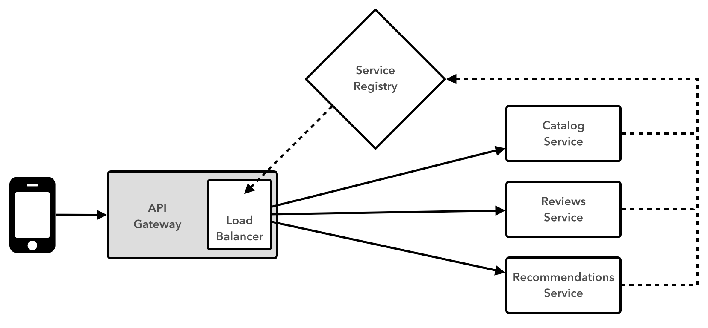

slidenumbers: true

# [fit] Cloud-Native
# [fit] Application
# [fit] Architectures
# [fit] with Spring and Cloud Foundry

---

# [fit] Session
# [fit] Four

---

# [fit] Microservices
# [fit] with
# [fit] Polyglot
# [fit] Peristence:
# [fit] Part 2

---

# [fit] SpringBox!

---

---

# We'll implement the front-end of this service...

---

# Imagine 4 Teams:

- Movie Catalog
- Movie Reviews
- Movie Recommendations
- Web UI

---

# SpringBox High-Level Architecture

---

# In this session...

- Movie Catalog (MySQL)
- Movie Reviews (MongoDB)
- Movie Recommendations (Neo4J)
- All via Spring Data

---

# Tomorrow...

We'll start using distributed system patterns to glue it all together!

---

# [fit] TO THE
# [Fit] LABS!
