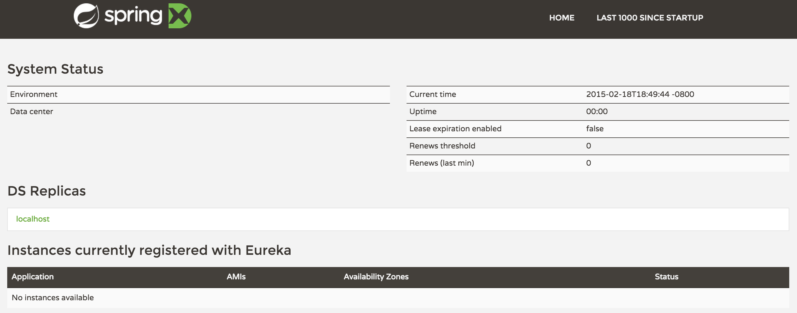
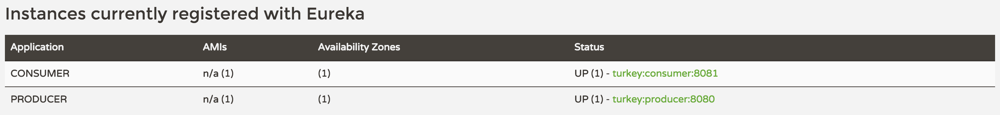
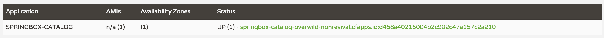

:compat-mode:
= Lab 16 - Leveraging Eureka for Service Discovery via Spring Cloud Netflix

[abstract]
--
Let's continue learning the components found in Spring Cloud to implement patterns for distributed systems.
We'll use Spring Cloud Netflix to deploy Eureka, which is a component offering service registration and discovery.

In this lab, we'll do the following:

. Create a Eureka server
. Create two applications, a ``producer'' and a ``consumer,'' wire them up using Eureka, and test them.
. Deploy the Eureka server to Pivotal Web Services
. Update our previously developed microservices to register themselves with Eureka
--

== Creating a Eureka Server

. Change to the lab directory:
+
----
$ cd $COURSE_HOME/day_02/session_05/lab_16/initial/springbox-eureka
----
+
and import the project (via `pom.xml`) into your IDE of choice.

. Open `pom.xml`, change the parent POM to the `spring-cloud-starter-parent`:
+
----
<parent>
  <groupId>org.springframework.cloud</groupId>
  <artifactId>spring-cloud-starter-parent</artifactId>
  <version>1.0.0.RC3</version>
  <relativePath/>
  <!-- lookup parent from repository -->
</parent>
----

. Add the Spring Milestone repository (as Spring Cloud is still pre-GA):
+
----
<repositories>
  <repository>
    <id>spring-milestones</id>
    <name>Spring Milestones</name>
    <url>https://repo.spring.io/libs-milestone/</url>
    <snapshots>
      <enabled>true</enabled>
      </snapshots>
  </repository>
</repositories>
----

. Add a dependency on `spring-cloud-starter-eureka-server`:
+
----
<dependency>
  <groupId>org.springframework.cloud</groupId>
  <artifactId>spring-cloud-starter-eureka-server</artifactId>
</dependency>
----

. Also, update the `spring-boot-maven-plugin` configuration to indicate that jars containing JAX-RS resources should be unpacked:
+
----
<plugin>
  <groupId>org.springframework.boot</groupId>
  <artifactId>spring-boot-maven-plugin</artifactId>
  <configuration>
    <requiresUnpack>
      <dependency>
        <groupId>com.netflix.eureka</groupId>
        <artifactId>eureka-core</artifactId>
      </dependency>
      <dependency>
        <groupId>com.netflix.eureka</groupId>
        <artifactId>eureka-client</artifactId>
      </dependency>
    </requiresUnpack>
  </configuration>
</plugin>
----

. In `io.springbox.eureka.SpringboxEurekaApplication`, add the `@EnableEurekaServer` annotation:
+
----
@SpringBootApplication
@EnableEurekaServer    // <-- ADD THIS!
public class SpringboxEurekaApplication {

    public static void main(String[] args) {
        SpringApplication.run(SpringboxEurekaApplication.class, args);
    }
}
----

. Rename `src/main/resources/application.properties` to `src/main/resources/application.yml`, and paste in the following source:
+
----
server:
  port: 8761

eureka:
  instance:
    hostname: localhost
  client:
    registerWithEureka: false
    fetchRegistry: false
    serviceUrl:
      defaultZone: http://${eureka.instance.hostname}:${server.port}/eureka/
----

. Build the application:
+
----
$ mvn package
----

. Run the application:
+
----
$ java -jar target/springbox-eureka-0.0.1-SNAPSHOT.jar
----

. In a browser, visit http://localhost:8761 and verify that everything is working properly:
+

== Create and Register the Producer Service

. Change to the lab directory:
+
----
$ cd $COURSE_HOME/day_02/session_05/lab_16/initial/springbox-producer
----
+
and import the project (via `pom.xml`) into your IDE of choice.

. Open `pom.xml`, change the parent POM to the `spring-cloud-starter-parent`:
+
----
<parent>
  <groupId>org.springframework.cloud</groupId>
  <artifactId>spring-cloud-starter-parent</artifactId>
  <version>1.0.0.RC3</version>
  <relativePath/>
  <!-- lookup parent from repository -->
</parent>
----

. Add the Spring Milestone repository (as Spring Cloud is still pre-GA):
+
----
<repositories>
  <repository>
    <id>spring-milestones</id>
    <name>Spring Milestones</name>
    <url>https://repo.spring.io/libs-milestone/</url>
    <snapshots>
      <enabled>true</enabled>
      </snapshots>
  </repository>
</repositories>
----

. Add a dependency on `spring-cloud-starter` and `spring-cloud-starter-eureka`:
+
----
<dependency>
  <groupId>org.springframework.cloud</groupId>
  <artifactId>spring-cloud-starter</artifactId>
</dependency>
<dependency>
  <groupId>org.springframework.cloud</groupId>
  <artifactId>spring-cloud-starter-eureka</artifactId>
</dependency>
----

. In the package `io.springbox.producer`, create the class `GreetingController`.
Into that class paste the following code:
+
----
@RestController
public class ProducerController {

    private Log log = LogFactory.getLog(ProducerController.class);
    private AtomicInteger counter = new AtomicInteger(0);

    @RequestMapping(value = "/", produces = "application/json")
    public String produce() {
        int value = counter.getAndIncrement();
        log.info("Produced a value: " + value);

        return String.format("{\"value\":%d}", value);
    }

}
----

. Now open `io.springbox.producer.SpringboxProducerApplication` and add the `@EnableDiscoveryClient` annotation:
+
----
@SpringBootApplication
@EnableDiscoveryClient  // <--- ADD THIS!
public class SpringboxProducerApplication {

    public static void main(String[] args) {
        SpringApplication.run(SpringboxProducerApplication.class, args);
    }
}
----

. Create the file `src/main/resources/bootstrap.yml` and paste in the following source:
+
----
spring:
  application:
    name: producer
----

. We'll use our Config Server to consistently configure the Eureka Client across all of our applications.
In your config repo, open `application.yml` and add the following:
+
----
eureka:
  instance:
    leaseRenewalIntervalInSeconds: 10
    metadataMap:
      instanceId: ${vcap.application.instance_id:${spring.application.name}:${server.port:8080}}
----

. Stage, commit, and push your changes:
+
----
git add . && git commit -m "swap greeting" && git push origin master
----

. A completed `springbox-config-server` project has been placed in `$COURSE_HOME/day_02/session_05/lab_15/initial/springbox-config-server` for your convenience.
In a different terminal window, change to that directory, rebuild, and run the application:
+
----
$ cd $COURSE_HOME/day_02/session_05/lab_16/initial/springbox-config-server
$ mvn packaage
$ java -jar target/springbox-config-server-0.0.1-SNAPSHOT.jar
----

. Now build the producer application:
+
----
$ mvn package
----

. And run the producer application:
+
----
$ java -jar target/springbox-producer-0.0.1-SNAPSHOT.jar
----

. Ten seconds after the producer application finishes startup, you should see it log its registration with Eureka:
+
----
2015-02-18 22:56:00.226  INFO 42160 --- [pool-4-thread-1] com.netflix.discovery.DiscoveryClient    : DiscoveryClient_PRODUCER/turkey:producer:8080 - Re-registering apps/PRODUCER
2015-02-18 22:56:00.227  INFO 42160 --- [pool-4-thread-1] com.netflix.discovery.DiscoveryClient    : DiscoveryClient_PRODUCER/turkey:producer:8080: registering service...
2015-02-18 22:56:00.274  INFO 42160 --- [pool-4-thread-1] com.netflix.discovery.DiscoveryClient    : DiscoveryClient_PRODUCER/turkey:producer:8080 - registration status: 204
----
+
You should also be able to refresh http://localhost:8761 in the browser and see the producer registered:
+
image::../../../Common/images/eureka_2.png[]

== Create and Register the Consumer Service

. Change to the lab directory:
+
----
$ cd $COURSE_HOME/day_02/session_05/lab_16/initial/springbox-consumer
----
+
and import the project (via `pom.xml`) into your IDE of choice.

. Open `pom.xml`, change the parent POM to the `spring-cloud-starter-parent`:
+
----
<parent>
  <groupId>org.springframework.cloud</groupId>
  <artifactId>spring-cloud-starter-parent</artifactId>
  <version>1.0.0.RC3</version>
  <relativePath/>
  <!-- lookup parent from repository -->
</parent>
----

. Add the Spring Milestone repository (as Spring Cloud is still pre-GA):
+
----
<repositories>
  <repository>
    <id>spring-milestones</id>
    <name>Spring Milestones</name>
    <url>https://repo.spring.io/libs-milestone/</url>
    <snapshots>
      <enabled>true</enabled>
      </snapshots>
  </repository>
</repositories>
----

. Add a dependency on `spring-cloud-starter` and `spring-cloud-starter-eureka`:
+
----
<dependency>
  <groupId>org.springframework.cloud</groupId>
  <artifactId>spring-cloud-starter</artifactId>
</dependency>
<dependency>
  <groupId>org.springframework.cloud</groupId>
  <artifactId>spring-cloud-starter-eureka</artifactId>
</dependency>
----

. In the package `io.springbox.consumer`, create the class `ProducerResponse`, and into that class paste the following code:
+
----
public class ProducerResponse {
    private int value;

    public void setValue(int value) {
        this.value = value;
    }

    public int getValue() {
        return value;
    }
}
----

. Also in the package `io.springbox.consumer`, create the class `ConsumerController`, and into that class paste the following code:
+
----
@RestController
public class ConsumerController {

    @Autowired
    DiscoveryClient discoveryClient;

    @RequestMapping(value = "/", produces = "application/json")
    String consume() {
        InstanceInfo instance = discoveryClient.getNextServerFromEureka("PRODUCER", false);

        RestTemplate restTemplate = new RestTemplate();
        ProducerResponse response = restTemplate.getForObject(instance.getHomePageUrl(), ProducerResponse.class);

        return String.format("{\"value\":%d}", response.getValue());
    }

}
----

. Now open `io.springbox.producer.SpringboxConsumerrApplication` and add the `@EnableDiscoveryClient` annotation:
+
----
@SpringBootApplication
@EnableDiscoveryClient  // <--- ADD THIS!
public class SpringboxConsumerApplication {

    public static void main(String[] args) {
        SpringApplication.run(SpringboxConsumerApplication.class, args);
    }
}
----

. In `src/main/resources/application.properties`, set the `server.port` property:
+
----
server.port=8081
----

. Create the file `src/main/resources/bootstrap.yml` and paste in the following source:
+
----
spring:
  application:
    name: consumer
----

. Now build the consumer application:
+
----
$ mvn package
----

. And run the consumer application:
+
----
$ java -jar target/springbox-consumer-0.0.1-SNAPSHOT.jar
----

. Ten seconds after the consumer application finishes startup, you should see it log its registration with Eureka:
+
----
2015-02-18 23:29:55.703  INFO 45265 --- [pool-4-thread-1] com.netflix.discovery.DiscoveryClient    : DiscoveryClient_CONSUMER/turkey:consumer:8081 - Re-registering apps/CONSUMER
2015-02-18 23:29:55.703  INFO 45265 --- [pool-4-thread-1] com.netflix.discovery.DiscoveryClient    : DiscoveryClient_CONSUMER/turkey:consumer:8081: registering service...
2015-02-18 23:29:55.729  INFO 45265 --- [pool-4-thread-1] com.netflix.discovery.DiscoveryClient    : DiscoveryClient_CONSUMER/turkey:consumer:8081 - registration status: 204
----
+
You should also be able to refresh http://localhost:8761 in the browser and see the producer registered:
+

. Using `curl`, test the consumer application and show that it is receiving values from the producer:
+
----
curl -i localhost:8081
HTTP/1.1 200 OK
Content-Length: 11
Content-Type: application/json;charset=UTF-8Date: Thu, 19 Feb 2015 07:32:21 GMT
Server: Apache-Coyote/1.1
X-Application-Context: consumer:8081

{
    "value": 0
}
----

== Deploy the Eureka Server to Cloud Foundry

. Create an application manifest in `manifest.yml`:
+
[source,yml]
----
---
applications:
- name: springbox-eureka
  host: springbox-eureka-${random-word}
  memory: 512M
  instances: 1
  path: target/springbox-eureka-0.0.1-SNAPSHOT.jar
----

. Push to Cloud Foundry:
+
----
$ cf push

...

Showing health and status for app springbox-eureka in org oreilly-class / space instructor as mstine@pivotal.io...
OK

requested state: started
instances: 1/1
usage: 512M x 1 instances
urls: springbox-eureka-blowsy-catechizer.cfapps.io
last uploaded: Thu Feb 19 07:40:21 UTC 2015

     state     since                    cpu    memory           disk
#0   running   2015-02-18 11:41:10 PM   0.3%   386.1M of 512M   135.1M of 1G
----

. In a browser, visit the route assigned to your Eureka server and verify that everything is working properly:
+

== Update the Microservices to Use Eureka

. In the config repo, update the eureka section of application.yml:
+
----
eureka:
  instance:
    leaseRenewalIntervalInSeconds: 10
    metadataMap:
      instanceId: ${vcap.application.instance_id:${spring.application.name}:${server.port:8080}}
  client:    # <--- ADD THE CLIENT SECTION!!!
    serviceUrl:
      defaultZone: ${vcap.services.springbox-service-registry.credentials.uri:http://127.0.0.1:8761}/eureka/
----

. Also add a second YAML document to `application.yml`:
+
----
---
spring:
  profiles: cloud
eureka:
  instance:
    hostname: ${vcap.application.uris[0]}
    nonSecurePort: 80
----

. Stage, commit, and push your changes:
+
----
git add . && git commit -m "swap greeting" && git push origin master
----

Each of the three microservice projects has been copied into `$COURSE_HOME/day_02/session_05/lab_16/initial`, and are in the state we left them at the end of link:../lab_15/lab_15.adoc[Lab 15].
You can either continue your existing projects or pickup from these copies.

For each project, perform the following steps (we'll do these once for the `springbox-catalog` project in this guide):

. Change to the lab directory:
+
----
$ cd $COURSE_HOME/day_02/session_05/lab_16/initial/springbox-catalog
----
+
and import the project (via `pom.xml`) into your IDE of choice.

. In `pom.xml`, add a dependency on `spring-cloud-starter-eureka`:
+
----
<dependency>
  <groupId>org.springframework.cloud</groupId>
  <artifactId>spring-cloud-starter-eureka</artifactId>
</dependency>
----

. Now open `io.springbox.catalog.SpringboxCatalogApplication` and add the `@EnableDiscoveryClient` annotation:
+
----
@SpringBootApplication
@EnableJpaRepositories
@EnableDiscoveryClient  // <--- ADD THIS!!!
public class SpringboxCatalogApplication {

    public static void main(String[] args) {
        SpringApplication.run(SpringboxCatalogApplication.class, args);
    }
}
----

. Build the application:
+
----
$ mvn package
----

. In `manifest.yml`, add a binding to `springbox-service-registry`:
+
----
---
applications:
- name: springbox-catalog
  host: springbox-catalog-${random-word}
  memory: 512M
  instances: 1
  timeout: 90
  path: target/springbox-catalog-0.0.1-SNAPSHOT.jar
  env:
    SPRING_PROFILES_ACTIVE: cloud
  services:
    - springbox-catalog-db
    - springbox-config-service
    - springbox-cloud-bus-amqp
    - springbox-service-registry
----

. Push the application:
+
----
$ cf push

...

Showing health and status for app springbox-catalog in org oreilly-class / space instructor as mstine@pivotal.io...
OK

requested state: started
instances: 1/1
usage: 512M x 1 instances
urls: springbox-catalog-overwild-nonrevival.cfapps.io
last uploaded: Fri Feb 20 02:06:02 UTC 2015

     state     since                    cpu     memory           disk
#0   running   2015-02-19 06:07:35 PM   81.0%   446.1M of 512M   150.9M of 1G
----

. Ten seconds after the catalog application finishes startup, you should see it log its registration with Eureka:
+
----
2015-02-19T18:07:45.21-0800 [App/0]      OUT 2015-02-20 02:07:45.212  INFO 31 --- [pool-7-thread-1] com.netflix.discovery.DiscoveryClient    : DiscoveryClient_SPRINGBOX-CATALOG/springbox-catalog-overwild-nonrevival.cfapps.io:d458a40215004b2c902c47a157c2a2
10 - Re-registering apps/SPRINGBOX-CATALOG
2015-02-19T18:07:45.21-0800 [App/0]      OUT 2015-02-20 02:07:45.212  INFO 31 --- [pool-7-thread-1] com.netflix.discovery.DiscoveryClient    : DiscoveryClient_SPRINGBOX-CATALOG/springbox-catalog-overwild-nonrevival.cfapps.io:d458a40215004b2c902c47a157c2a2
10: registering service...
2015-02-19T18:07:45.27-0800 [App/0]      OUT 2015-02-20 02:07:45.277  INFO 31 --- [pool-7-thread-1] com.netflix.discovery.DiscoveryClient    : DiscoveryClient_SPRINGBOX-CATALOG/springbox-catalog-overwild-nonrevival.cfapps.io:d458a40215004b2c902c47a157c2a2
10 - registration status: 204
----
+
You should also be able to refresh the route of your PWS deployed Eureka in the browser and see the catalog registered:
+

