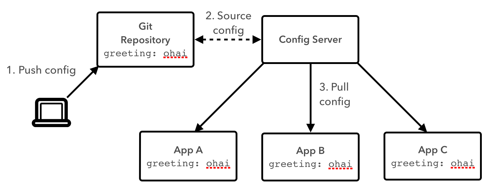
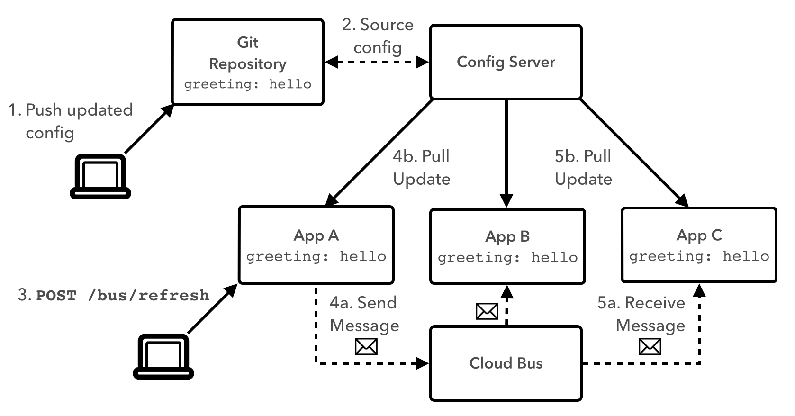
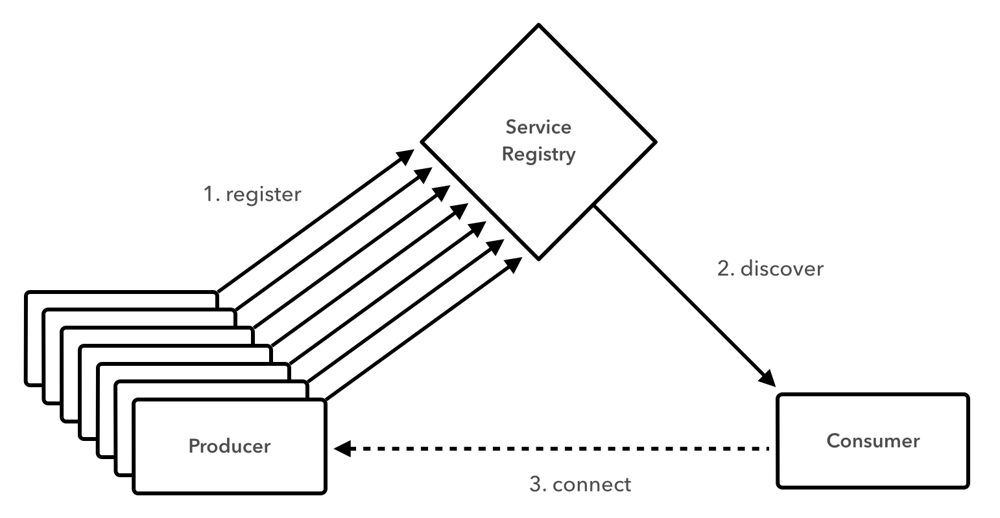

slidenumbers: true

# [fit] Cloud-Native
# [fit] Application
# [fit] Architectures
# [fit] with Spring and Cloud Foundry


---

# [fit] Session
# [fit] Five


---

# [fit] Cloud-Native
# [fit] Architecture
# [fit] Patterns:
# [fit] Part 1

---

# Patterns On-Deck

* Consistent and Distributed Configuration
* Service Registration and Discovery

---

# [fit] Writing a Single Service is
# [fit] Nice...

---

# [fit] But No Microservice
# [fit] is an Island


---

# Challenges of Distributed Systems

* Configuration Management
* Service Registration & Discovery
* Routing & Load Balancing
* Fault Tolerance (Circuit Breakers!)
* Monitoring
* Concurrent API Aggregation & Transformation

---


---


# [fit] Spring Cloud
# [fit] Distributed System Patterns FTW!

---


# [fit] Configuration
# [fit] Management

---

# [fit] Distributed?

---


# [fit] Config
# [fit] Server!

---



---

# Config Server `app.groovy`

```java
@Grab("org.springframework.cloud:spring-cloud-starter-bus-amqp:1.0.0.RC1")
@EnableConfigServer
class ConfigServer {
}
```

---

# Config Server `application.yml`

```
server:
  port: 8888

spring:
  cloud:
    config:
      server:
        git:
          uri: https://github.com/mstine/config-repo.git
```

---


# `https://github.com/mstine/config-repo/blob/master/demo.yml`

```
greeting: Bonjour
```

---

# Config Client `app.groovy`

```java
@Grab("org.springframework.cloud:spring-cloud-starter-bus-amqp:1.0.0.RC1")
@RestController
class BasicConfig {

  @Autowired
  Greeter greeter

  @RequestMapping("/")
  String home() {
    "${greeter.greeting} World!"
  }
}

@Component
@RefreshScope
class Greeter {

  @Value('${greeting}')
  String greeting

}
```

---

# Config Client `bootstrap.yml`

```
spring:
  application:
    name: demo
```

---


# [fit] Cloud
# [fit] Bus!

---



---

# [fit] `curl -X POST http://localhost:8080/bus/refresh`

---


# [fit] Service
# [fit] Registration &
# [fit] Discovery

---



---

# [fit] Eureka


---

# [fit] Producer
# [fit] Consumer

---

# Eureka Service Registry

```java
@GrabExclude("ch.qos.logback:logback-classic")
@EnableEurekaServer
class Eureka {
}
```

---

# Producer

```java
@EnableDiscoveryClient
@RestController
public class Application {

  int counter = 0

  @RequestMapping("/")
  String produce() {
    "{\"value\": ${counter++}}"
  }
}
```

---

# Consumer

```java
@EnableDiscoveryClient
@RestController
public class Application {

  @Autowired
  DiscoveryClient discoveryClient

  @RequestMapping("/")
  String consume() {
    InstanceInfo instance = discoveryClient.getNextServerFromEureka("PRODUCER", false)

    RestTemplate restTemplate = new RestTemplate()
    ProducerResponse response = restTemplate.getForObject(instance.homePageUrl, ProducerResponse.class)

    "{\"value\": ${response.value}}"
  }
}

public class ProducerResponse {
  Integer value
}
```

---

# [fit] TO THE
# [Fit] LABS!
