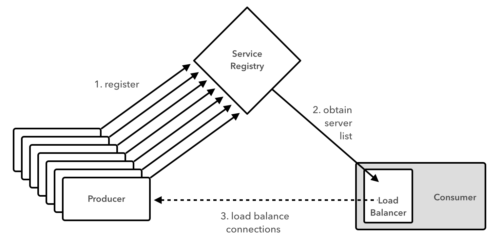
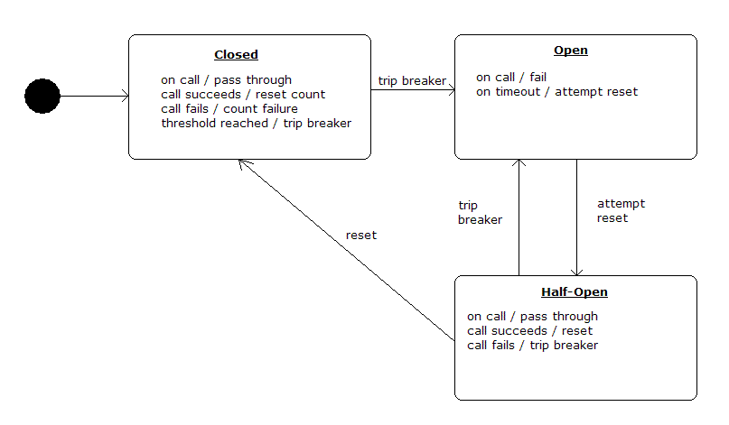
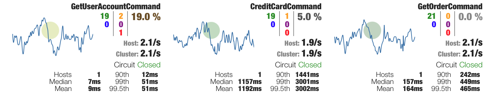

slidenumbers: true

# [fit] Cloud-Native
# [fit] Application
# [fit] Architectures
# [fit] with Spring and Cloud Foundry


---

# [fit] Session
# [fit] Six


---

# [fit] Cloud-Native
# [fit] Architecture
# [fit] Patterns:
# [fit] Part 2

---

# Patterns On-Deck

* Routing/Load Balancing
* Fault Tolerance

---


# [fit] Routing &
# [fit] Load Balancing

---



---

# [fit] Ribbon


---

# Consumer with Load Balancer

```java
@Autowired
LoadBalancerClient loadBalancer

@RequestMapping("/")
String consume() {
  ServiceInstance instance = loadBalancer.choose("producer")
  URI producerUri = URI.create("http://${instance.host}:${instance.port}");

  RestTemplate restTemplate = new RestTemplate()
  ProducerResponse response = restTemplate.getForObject(producerUri, ProducerResponse.class)

  "{\"value\": ${response.value}}"
}
```

---

# Consumer with Ribbon-enabled `RestTemplate`

```java
@Autowired
RestTemplate restTemplate

@RequestMapping("/")
String consume() {
  ProducerResponse response = restTemplate.getForObject("http://producer", ProducerResponse.class)

  "{\"value\": ${response.value}}"
}
```

---

# Feign Client

```java
@FeignClient("producer")
public interface ProducerClient {

  @RequestMapping(method = RequestMethod.GET, value = "/")
  ProducerResponse getValue();
}
```

---

# Consumer with Feign Client

```java
@SpringBootApplication
@FeignClientScan
@EnableDiscoveryClient
@RestController
public class Application {

  @Autowired
  ProducerClient client;

  @RequestMapping("/")
  String consume() {
    ProducerResponse response = client.getValue();

    return "{\"value\": " + response.getValue() + "}";
  }

  public static void main(String[] args) {
    SpringApplication.run(Application.class, args);
  }
}
```

---


# [fit] Fault
# [fit] Tolerance

---

# [fit] Hystrix


---

# Circuit Breaker


---

# Consumer `app.groovy`

```java
@EnableDiscoveryClient
@EnableCircuitBreaker
@RestController
public class Application {

  @Autowired
  ProducerClient client

  @RequestMapping("/")
  String consume() {
    ProducerResponse response = client.getProducerResponse()

    "{\"value\": ${response.value}}"
  }

}
```

---

# Producer Client

```java
@Component
public class ProducerClient {

  @Autowired
  RestTemplate restTemplate

  @HystrixCommand(fallbackMethod = "getProducerFallback")
  ProducerResponse getProducerResponse() {
    restTemplate.getForObject("http://producer", ProducerResponse.class)
  }

  ProducerResponse getProducerFallback() {
    new ProducerResponse(value: 42)
  }
}
```

---


# [fit] Monitoring

---

# [fit] Hystrix
# [fit] Dashboard


---

# Hystrix Dashboard



---

# Hystrix Dashboard

```java
@Grab("org.springframework.cloud:spring-cloud-starter-hystrix-dashboard:1.0.0.RC1")

import org.springframework.cloud.netflix.hystrix.dashboard.EnableHystrixDashboard

@EnableHystrixDashboard
class HystrixDashboard {
}
```

---

# [fit] TO THE
# [fit] LABS!
