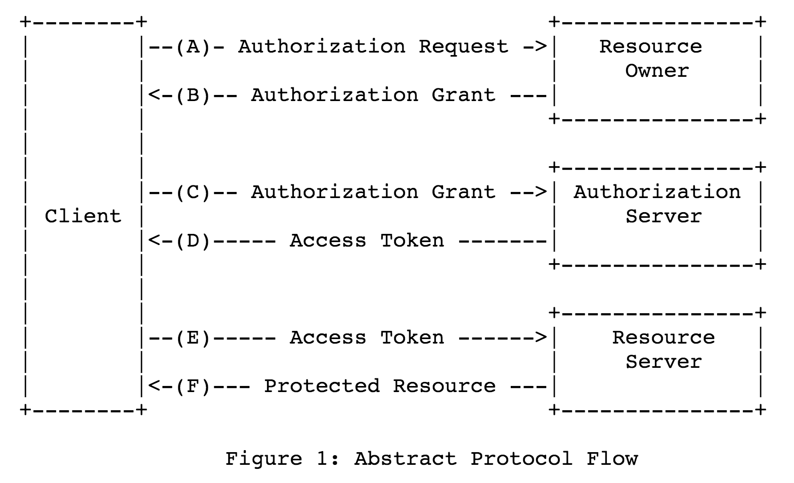

slidenumbers: true

# [fit] Cloud-Native
# [fit] Application
# [fit] Architectures
# [fit] with Spring and Cloud Foundry


---

# [fit] Session
# [fit] Seven


---

# [fit] Securing
# [fit] Cloud-Native
# [fit] Applications

---

# [fit] Stop
# [fit] bad guys
# [fit] from accessing your resources!

---

# Requirements?

* How is identity and permission information conveyed?
* How is it decoded and interpreted?
* What data are needed to make the access decision?
* Who is responsible for storing and
  retrieving the data?
* How can you verify that the request hasn't been tampered with?

---

# [fit] OAuth2

---

# OAuth2 Flow



---

# Key Features (1/2)

* IETF standard
* Simple for clients (and developers)
* Tokens carry information (beyond identity)
* Clear separation between users and machines

---

# Key Features (2/2)

* Emphasis on not collecting user credentials in client app
* Machines act on their own or on behalf of users
* Resources are free to interpret token content

---

# OAuth2 and the Microservice

Example command line Client:

```
$ curl -H "Authorization: Bearer $TOKEN" https://myhost/resource
```

* `https://myhost` is a Resource Server.
* `TOKEN` is a Bearer Token.
* It came from an Authorization Server.

---

# Simple Resource Server

```java
@EnableResourceServer
class ResourceServer {
	@Bean
	JwtTokenStore tokenStore() throws Exception {
		JwtAccessTokenConverter enhancer =
            new JwtAccessTokenConverter()
		enhancer.afterPropertiesSet()
		new JwtTokenStore(enhancer)
	}
}
```

NOTE: in a real system you would have to configure the verifierKey (or use JdbcTokenStore)

---

# Simple Authorization Server

```java
@EnableAuthorizationServer
class AuthorizationServer extends AuthorizationServerConfigurerAdapter {

   @Override
   void configure(ClientDetailsServiceConfigurer clients) throws Exception {
      clients.inMemory()
         .withClient("my-client-with-secret")...
   }

}
```

---

# Example token contents

* Client ID
* Resource ID (audience)
* Issuer
* User ID
* Role Assignments

---

# JWT Bearer Tokens

* OAuth 2.0 tokens are opaque to clients
* But they carry important information to Resource Servers
* JWT = signed, base64-encoded, JSON

---

# Example JWT Implementation

(from Cloud Foundry UAA)

```
{  "client_id":"cf",
   "exp":1346325625,
   "scope":["cloud_controller.read","openid","password.write"],
   "aud":["openid","cloud_controller","password"],
   "iss": "https://login.run.pivotal.io",
   "user_name":"tester@vmware.com",
   "user_id":"52147673-9d60-4674-a6d9-225b94d7a64e",
   "email":"tester@vmware.com",
   "jti":"f724ae9a-7c6f-41f2-9c4a-526cea84e614" }
```

---

# OAuth2 and the Microservice

* Resource Servers might be Microservices
* *Web App Clients*: authorization code grant
* *Browser Clients (SPAs)*: authorization code grant (better) or implicit grant
* *Mobile and Non-Browser Clients*: password grant (maybe with mods for multifactor etc.)
* *Service Clients (intra-system)*: client credentials or relay user token

---

# Spring Cloud Security

* Abstraction over Spring Security OAuth2
* Makes common microservice security use cases easier
* Convention over Configuration
* Smooth UX for deployment on Cloud Foundry

---

## Simple SSO Client

```java
@EnableOAuth2Sso
@Controller
class Demo {
}
```

```
$ spring jar app.jar app.groovy
$ cf push -p app.jar
```

(That's it.)

---

# How Does that Work? (1/2)

*Answer*: configuration conventions (the app was bound to a service).

```
$ cf bind-service app sso
```

and the service provides credentials.

---

# How Does that Work? (2/2)

To create the same bindings manually (e.g. in `application.yml`):

```
oauth2:
  client:
    tokenUri: https://login.run.pivotal.io/oauth/token
    authorizationUri: https://login.run.pivotal.io/oauth/authorize
    clientId: acme
    clientSecret: ${CLIENT_SECRET}
  resource:
    tokenInfoUri: http://uaa.run.pivotal.io/check_token
    id: openid
    serviceId: ${PREFIX:}resource
```

---

## Resource Server with Spring Cloud

```java
@EnableOAuth2Resource
@EnableEurekaClient
@RestController
class Demo {
  @RequestMapping("/")
  def home() { [id: UUID.randomUUID().toString(), content: "Hello Remote"] }
}
```

---

# How Does that Work?

* Same as `@EnableOAuth2Sso`
* Bind to service for conventional external configuration

---

# Single Page Apps

* With backend services CORS restrictions make reverse proxy useful (`@EnableZuulProxy`).
* Then you can acquire tokens in the client app and relay them to back end.

---

# Relaying User Tokens (1/2)

* Front end app sends SSO token with user credentials to authenticate back end requests
* Back ends relay it to each other as necessary.

---

# Relaying User Tokens (2/2)

Simple but possibly flawed: the front end only needs access to user details to authenticate, but you need to give it permission to do other things to allow it access to the back ends.

Idea: exchange (with full authentication) the incoming token for an outgoing one with different permissions (client but not scope). Can use password grant (e.g. with the incoming token as a password).

---

## Token Relay with Spring Cloud

```java
@EnableOAuth2Sso
@EnableZuulProxy
@Controller
class Demo {
}
```

* Autoconfiguration for `@EnableZuulProxy` combined with `@EnableOAuth2Sso`
* Adds `ZuulFilter` that attaches the current user token to downstream requests

---

# [fit] TO THE
# [fit] LABS!
